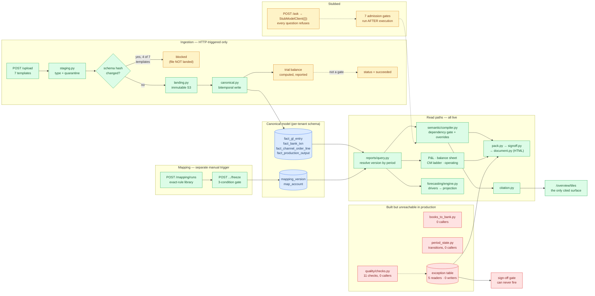

# ONBOARDING.md

For a technical co-founder joining SPEQULA. Read time ~10 minutes; the reading list at the end is
another ~90. Written 2026-08-27 against HEAD `d720199`.

---

## (a) The system in five sentences

SPEQULA ingests an Indian mid-market company's accounting exports (GL, trial balance, chart of
accounts, bank, and profile-specific operating files), stages and hashes them, and writes them into a
bitemporal canonical model where nothing is ever overwritten — a changed fact closes its prior row
and inserts a new one. An analyst then maps that company's raw ledger names onto an 86-class
canonical taxonomy through a versioned, effective-dated mapping that must clear a freeze gate (no
unassigned ledgers, no unapproved rows, ≥98% coverage by rupee value) before any number is served.
Statements, operating metrics and a signed monthly board pack are assembled by reading facts through
whichever mapping version governs the reporting period, while individual metrics are resolved by a
deterministic compiler that walks a dependency graph of 61 corpus-derived contracts and refuses to
return a number whose governing decision is still open. A natural-language Ask surface exists behind
a validated semantic IR — the model never writes SQL — but it is currently dark: the model client is
a stub with an empty fixture set, so every question refuses. The whole thing is governed by
`CLAUDE.md` and a 16-file `/corpus` specification whose stated purpose is to prevent one specific
failure: a plausible wrong number reaching a board pack.

**Stack:** Python 3.12 / FastAPI / raw `psycopg` (no ORM) / PostgreSQL 16 schema-per-tenant /
Next.js 15 + Tailwind / WorkOS auth / S3-compatible object storage. 320 tests, all passing.

---

## (b) The architecture as actually built

**Green** = works end to end today. **Amber** = present but non-functional as wired. **Red** = built,
tested, and never called by any production code path.

---

## (c) How this differs from the intended diagram

| Intended | Actual |
|---|---|
| Ingest → validate → **reconcile** → **map** → model, as one chain | Ingest and map are **two separate manual HTTP calls**. Reconciliation is not in the chain at all — `books_to_bank.py` has zero callers. |
| "Files stored immutably; every load logged" | True for accepted files. A file rejected for schema drift returns **before** `land_file` — its bytes are never stored. |
| "Broken cells quarantined" | Quarantined rows are **counted, then discarded**. There is no quarantine table in any migration. |
| "Data Quality & Reconciliation · AI-assisted investigation" | 11 checks written and tested; **`write_exceptions` has no production caller**. The exception queue, data-health panels and pack DQ appendix all read a permanently empty table. AI-assisted investigation: no code. |
| "Client approves" the mapping | `run_mapping_pass(..., session.user_id)` stamps `approved_by` on every judgement-class row **in the same request that triggered the run**. No human sees a row. |
| Admission gates sit **between** the AI layer and the database | Execution happens at [ask.py:135](src/semantic/ask.py#L135); gates run at [:151](src/semantic/ask.py#L151), against a *reconstruction* of the query, not the query. Gates 3 and 5 accept `sql_text` and never read it. Gate 6 can't reject. Gate 7's output is discarded. |
| AI layer "reads the question · drafts commentary" | `StubModelClient({})` with an empty fixture dict — **every question refuses**. Commentary is human-typed; `pack.py` hardcodes `written_by: "human"`. |
| Metric registry "connected to **Tracxn** for competitor benchmarking" | Zero occurrences of `tracxn`/`benchmark`/`competitor` outside `node_modules`. `refusal.py` uses a competitor question as its canonical *unanswerable* example. |
| Forecast: "AI explains margin shifts **each quarter**" · `DOMAIN INTELLIGENCE LAYER` | Deterministic projection is real and good. The AI half doesn't exist; neither does the phrase "domain intelligence layer". **There is no scheduler anywhere in the repo** — no cron, no queue, no job table. |
| "Alerts as they happen" · "Potential actions ranked by impact" | No implementation of any kind. Both are named in `CLAUDE.md` §10 as out of scope. |
| "Every number traceable to its source file" | Only `/overview/tiles` and `/ask` carry citations. **Statements, operating metrics, the pack and forecasts return zero citations.** And a metric with no backing rows evaluates to `Decimal("0")`, `status="ok"` — displayed as a cited ₹0. |
| "Always-on controls: books must balance" | The trial balance is computed **after** the facts are written, and `status = "succeeded"` is set unconditionally. An out-of-balance month loads clean. No statement path checks it. |
| Tenancy: "RLS forced at the connection role" | The app connects as a Postgres **superuser** (`rolsuper = True`, verified), which bypasses RLS unconditionally. Isolation currently rests on schema separation plus every query remembering its own `WHERE tenant_id`. |

**The pattern.** The left half of the diagram is largely real and carefully built. The right half
degrades sharply. And the recurring bug shape is the same in both halves: **a check that exists, is
correct, and runs after the thing it was meant to prevent** — gates after execution, trial balance
after commit.

**What's genuinely excellent, so you calibrate fairly:** the bitemporal write path, the mapping
freeze gate, the transitive dependency gate in the compiler, the refusal vocabulary, WorkOS JWT
verification (with a proper offline keypair test), and docstrings that disclose their own gaps
instead of hiding them. This is not sloppy work. It is careful work with unplugged wiring.

---

## (d) The five files to read yourself, in order

A deliberate arc: how data gets **in** → how a number gets **made** → how it gets **trusted** → how
tenants get **isolated** → how the model gets **fenced**. Roughly most-solid to most-broken.

**1. [src/ingest/load_pipeline.py:97–133](src/ingest/load_pipeline.py#L97) — 37 lines, read first.**
One function is the entire ingestion contract: create load run, stage, schema-hash check, land
immutably, write canonical, check the trial balance. Read it in execution order and notice two
things: the blocked branch returns at line 113 *before* `land_file`, and line 131 sets
`status = "succeeded"` without ever reading the trial-balance result computed two lines earlier. The
other six loaders in this file are copy-paste variants of it — which is why only four of them do the
schema check.

**2. [src/semantic/compiler.py](src/semantic/compiler.py) — 363 lines, the actual IP.**
`transitive_blocking_decisions` ([:117](src/semantic/compiler.py#L117)) is the idea the whole product
rests on: walk a metric's dependency closure and refuse to return a number if *any* ancestor is
governed by an unresolved decision. That is why `net_revenue` correctly returns "not available"
today rather than a plausible figure. Then read [:337–353](src/semantic/compiler.py#L337), where
`dso`/`dpo`/`dio` have their formulas rewritten **in Python** rather than read from the registry —
the one place `CLAUDE.md` invariant 2 is bent, and worth forming your own view on.

**3. [src/semantic/citation.py](src/semantic/citation.py) — 112 lines, the product promise.**
This is what "every number is traceable" actually means in code: metric version, period, mapping
version, row count, the source filenames, and how much value sat unmapped when it was computed.
Read `build_citation` ([:93](src/semantic/citation.py#L93)) and notice what it *doesn't* guard —
there is no check for `row_count == 0` or an empty `source_files` list, so a metric with nothing
behind it is cited as confidently as one backed by 40,000 rows. Three lines would fix it. This is the
highest-leverage small change in the repo.

**4. [src/api/deps/tenant.py](src/api/deps/tenant.py) — 62 lines, the biggest risk per line.**
The complete multi-tenant isolation story: resolve the tenant from a WorkOS-signed `org_id` claim,
never a header, then `set_config('app.tenant_id', ...)` so RLS policies apply. The design is right.
Then check what role you're actually connecting as — `SELECT rolsuper FROM pg_roles WHERE
rolname = current_user` returns `True` in both configured environments, and Postgres superusers
bypass RLS unconditionally. One `CREATE ROLE ... NOSUPERUSER` plus a boot-time assertion turns the
design into the reality.

**5. [src/semantic/admission.py](src/semantic/admission.py) — 140 lines, read last and skeptically.**
Seven named security gates. Read each function body against its own name. Gates 3 and 5 take
`sql_text` as a parameter and never reference it. Gate 4 is a substring search. Gate 6's guard
short-circuits on `None`, which is what its only caller passes. Gate 7 returns capped SQL the caller
discards. `sqlparse` is a dev-only dependency that is never imported. Read this file because it will
calibrate you on the difference between what this codebase claims and what it does — and because
half-working security controls are more dangerous than absent ones, since they get budgeted for.

> **Then skim [OPEN_QUESTIONS.md](OPEN_QUESTIONS.md)** (8 escalations) and `CLAUDE.md` §5 (15
> invariants). The escalations tell you what the team knows it doesn't know — which, on the evidence,
> is a lot and is honestly recorded. That culture is the main asset here.

**Deeper dives, already written:** [ARCHITECTURE_MAP.md](ARCHITECTURE_MAP.md) ·
[PIPELINE_TRACE.md](PIPELINE_TRACE.md) · [REQUEST_TRACE.md](REQUEST_TRACE.md) ·
[DATA_MODEL.md](DATA_MODEL.md) · [RISKS.md](RISKS.md)
